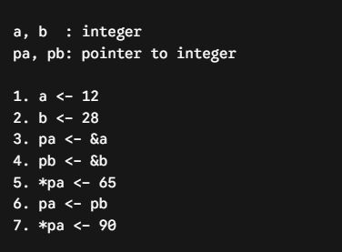
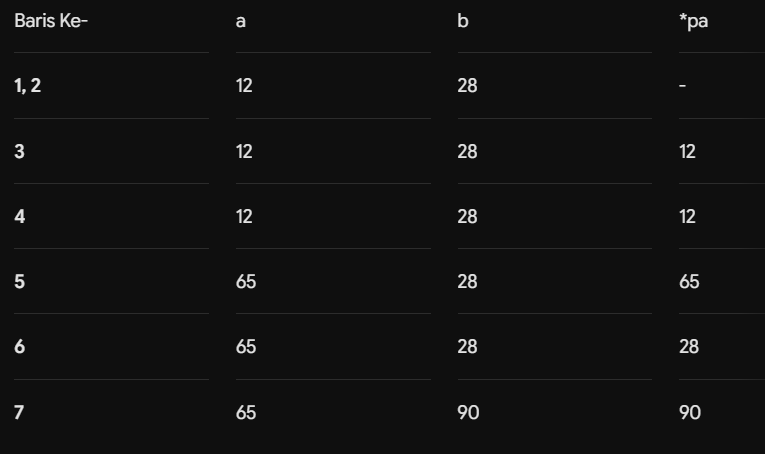
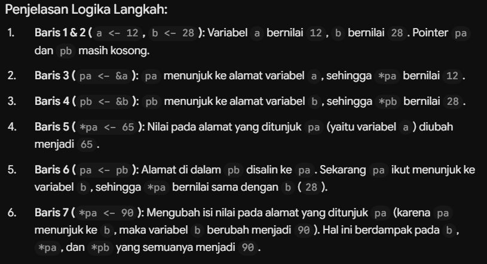

# Repository Struktur Data C++ (Studi Kasus & Implementasi)

Repositori ini berisi kumpulan program implementasi Struktur Data menggunakan C++ dengan berbagai variasi arsitektur, mulai dari Linear Linked List, Stack, Queue, Multi-Linked List (MLL), hingga Binary Search Tree (BST) lengkap dengan operasi tingkat lanjut.

---

## 📁 Daftar Modul & Arsitektur

### 1. Multi-Linked List (MLL)
*   **`mll_basic`**: MLL dengan Parent menunjuk langsung ke First Child (list linier ke bawah).
*   **`mll_norlist`**: MLL model *nested relation* (List Relasi bersarang di dalam node Parent).
*   **`mll_oneton`**: MLL model *One-to-N* (Child menunjuk langsung ke Parent).
*   **`mll_relasi` / `mll_v2`**: MLL standar menggunakan tabel relasi independen (Many-to-Many).

### 2. Single Linked List (SLL)
*   **`sll_basic`**: Single Linked List murni (hanya `head`) dengan studi kasus Mahasiswa.
*   **`sll_stack`**: Struktur data Stack berbasis Single Linked List.
*   **`sll_queue`**: Struktur data Queue berbasis Single Linked List (`head` & `tail`).

### 3. Berbasis Array
*   **`stack_array`**: Stack statis menggunakan Array.
*   **`queue_array`**: Queue statis menggunakan Array.
*   **`stack_v1`**: Variasi modular stack tambahan.

### 4. Tree & Advanced Operations
*   **`binary_tree`**: Implementasi **Binary Search Tree (BST)** dengan studi kasus E-Commerce.
    *   **Fitur & Operasi Lengkap:**
        *   Insert & Delete Node berdasarkan Key (*Harga Produk*).
        *   Pencarian Node (*Search*, *Find Min*, *Find Max*).
        *   Traversal: *Preorder*, *Inorder*, *Postorder*, dan *Level Order Traversal* (BFS).
        *   Properti Tree: Menghitung *Tinggi Tree*, *Jumlah Leaf Node*, dan *Total Size (Node)*.
        *   Transformasi & Validasi: *Validasi BST* (`isValidBST`) dan *Mirror / Invert Tree*.

### 5. Overview Logic




---

## ⚙️ Cara Kompilasi & Menjalankan
1. Masuk ke dalam folder modul yang diinginkan (contoh: `binary_tree`).
2. Kompilasi file sources secara bersamaan:
   ```bash
   g++ Sources/main.cpp Sources/binary_tree.cpp -o main